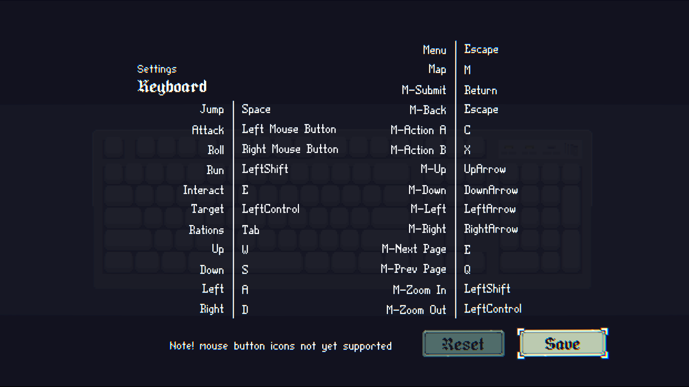

# Insignia Proper Rebinds

A BepInEx mod for **Insignia** that allows actions that are normally tied to the same input to be rebound independently.

The mod adds separate keybinds for gameplay and menu navigation while preserving the game's default controls.


## Features

* Independently rebind actions that normally share a key.
* Rebind keybinds that are normally locked by the game, including the menu keybind.
* Allow normally reserved keys, such as Return and Escape, to be assigned to keybinds.



## Requirements

* Insignia
* BepInEx 5
* Windows
* The version of Insignia supported by the current release

This mod was developed and tested with:

* **Unity:** 2022.3.62
* **BepInEx:** 5.4.23.5
* **Insignia Playtest**

Because this mod patches Insignia's game assemblies, updates to the game may require an update to the mod.

---

# Installation

## 1. Install BepInEx

Download **BepInEx 5** from the official BepInEx releases:

[BepInEx releases](https://github.com/BepInEx/BepInEx/releases)

Make sure you download the appropriate **BepInEx 5 Windows build** for the game.

Extract the contents of the BepInEx archive into your Insignia installation directory.

Your game directory should contain the BepInEx files alongside the game's executable, for example:

```text
Insignia Playtest/
├── BepInEx/
├── Insignia.exe
├── Insignia_Data/
└── ...
```

The official BepInEx documentation provides additional installation instructions if needed:

[BepInEx installation guide](https://docs.bepinex.dev/v5.4.16/articles/user_guide/installation/index.html)

## 2. Run Insignia once

Launch the game once after installing BepInEx.

This allows BepInEx to create its configuration files and verify that it is loading correctly.

After the first launch, you should have a:

```text
BepInEx/
├── config/
└── LogOutput.txt
```

directory/file structure.

## 3. Install Insignia Proper Rebinds

Download the latest **InsigniaProperRebinds.dll** from the project's GitHub Releases page.

[Latest releases](https://github.com/McChoc/InsigniaProperRebinds/releases/latest)

Place the downloaded DLL in the `<Insignia installation>\BepInEx\plugins` directory.

Done. Launch the game normally.

---

# Building from Source

## Requirements

To build the mod from source, you will need:

* Visual Studio 2022 or another compatible .NET development environment
* .NET SDK
* Git
* Insignia installed
* BepInEx 5 development dependencies

The project targets:

```text
netstandard2.1
```

## 1. Clone the repository

Clone the repository:

```bash
git clone https://github.com/McChoc/InsigniaProperRebinds.git
cd InsigniaProperRebinds
```

## 2. Obtain the game assemblies

The project references several assemblies from Insignia's `Insignia_Data/Managed` directory.

These assemblies are intentionally not included in the source repository.

The required files are:

```text
Assembly-CSharp.dll
FMODUnity.dll
Helpers.Assembly.dll
Rewired_Core.dll
Unity.TextMeshPro.dll
UnityEngine.UI.dll
```

Copy these files from:

```text
<Insignia installation>/Insignia_Data/Managed/
```

into the project's:

```text
Lib/
```

directory.

The resulting structure should look like:

```text
InsigniaProperRebinds/
├── Lib/
│   ├── Assembly-CSharp.dll
│   ├── FMODUnity.dll
│   ├── Helpers.Assembly.dll
│   ├── Rewired_Core.dll
│   ├── Unity.TextMeshPro.dll
│   └── UnityEngine.UI.dll
├── ...
└── InsigniaProperRebinds.csproj
```

The `Lib/` directory is excluded from version control because these assemblies are supplied by the game.

## 3. Restore dependencies

Open the solution/project in your IDE and restore the NuGet packages.

Alternatively, from the command line:

```bash
dotnet restore
```

The project will download its BepInEx and Unity package dependencies automatically.

## 4. Build

Build the project in your IDE or run:

```bash
dotnet build --configuration Release
```

The compiled plugin will be placed in the project's `bin/Release/netstandard2.1/` directory.

## 5. Install your development build

Copy:

```text
InsigniaProperRebinds.dll
```

to:

```text
<Insignia installation>/BepInEx/plugins/
```

For development, you can also configure your IDE to copy the DLL directly to the game's BepInEx plugins directory after a successful build.
